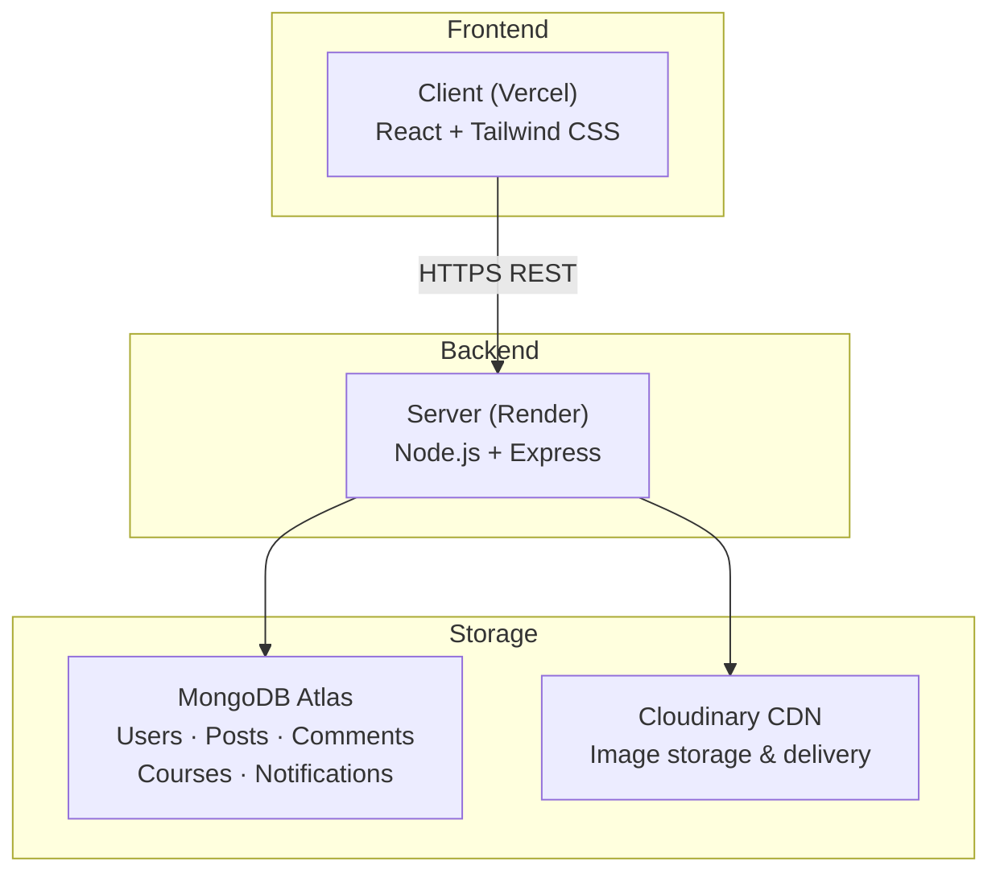

# NEU Seattle Connect

> A student-run community platform built exclusively for Northeastern University Seattle — share events, collaborate on projects, and explore honest course insights.

**🌐 Live demo: [neu-seattle-connect.vercel.app](https://neu-seattle-connect.vercel.app)**

---

## Why We Built This

NEU Seattle is a small, tight-knit campus — yet students routinely feel disconnected from one another. There's no student-run digital space to post about events, share side projects, or discuss coursework. Existing tools see almost no adoption, and a physical bulletin board is the closest thing to a community feed.

We built NEU Seattle Connect to give students ownership over their own campus culture. Sign up with your NEU email, build a profile, and engage with your campus community in one place. The architecture is designed for replication — other campuses can adopt it to build their own isolated network, the same way early Facebook scaled campus by campus.

---

## Features

**Community Feed**
Post events, projects, and general updates. Like, comment, save, and upload images. Filter by category to find what you're looking for.

**Course Insights**
Honest student takes on workload, teaching style, and career relevance — structured discussion, not star ratings. Once a course has enough reviews, an **AI-generated summary** automatically synthesises the collective experience into a concise at-a-glance snapshot, so students can make informed decisions without reading every post.

**User Profiles**
Showcase your major, year, interests, and bio. See posts from any student on their profile page.

Additional: notification system for likes and comments, full-text search, image uploads via Cloudinary, and access restricted to `@northeastern.edu` addresses.

---

## Architecture



**Auth flow:** JWT is attached to every request via an axios interceptor in `client/src/api/index.js`. A 401 response automatically clears local storage and redirects to `/login`. All write and authenticated routes on the backend are gated by the `protect` middleware.

---

## API Overview

| Method | Endpoint | Auth | Description |
|--------|----------|:----:|-------------|
| POST | `/api/auth/register` | | Register with NEU email |
| POST | `/api/auth/login` | | Login, returns JWT |
| GET | `/api/posts` | | Get posts, supports `?category=` |
| POST | `/api/posts` | ✓ | Create a post |
| PATCH | `/api/posts/:id/react` | ✓ | Toggle like reaction |
| DELETE | `/api/posts/:id` | ✓ | Delete own post |
| GET | `/api/comments/:postId` | | Get comments with nested replies |
| POST | `/api/comments/:postId` | ✓ | Post a comment |
| POST | `/api/comments/:id/reply` | ✓ | Reply to a comment |
| GET | `/api/courses` | | Get course list |
| GET | `/api/courses/:code` | | Get course detail + threads |
| GET | `/api/users/:id` | | Get user profile |
| PATCH | `/api/users/me` | ✓ | Update own profile |
| POST | `/api/upload/image` | ✓ | Upload post image to Cloudinary |
| POST | `/api/upload/avatar` | ✓ | Upload avatar (auto 400×400 crop) |
| GET | `/api/notifications` | ✓ | Get notifications + unread count |
| PATCH | `/api/notifications/read-all` | ✓ | Mark all as read |
| GET | `/api/search` | | Full-text search across posts |

---

## Tech Stack

| Layer | Technology |
|---|---|
| Frontend | React, Tailwind CSS |
| Backend | Node.js, Express |
| Database | MongoDB Atlas |
| Auth | JWT, bcrypt |
| Image storage | Cloudinary |
| AI | Anthropic Claude API (Haiku) |
| Deployment | Vercel (frontend), Render (backend) |

---

## Running Locally

### Prerequisites
- Node.js v18+
- A MongoDB Atlas account
- A Cloudinary account

### 1. Backend

```bash
cd server
npm install
```

Create a `.env` file in `/server`:

```env
MONGODB_URI=            # MongoDB Atlas connection string
JWT_SECRET=             # Any long random string
CLOUDINARY_CLOUD_NAME=  # From Cloudinary dashboard
CLOUDINARY_API_KEY=
CLOUDINARY_API_SECRET=
PORT=8080
```

```bash
npm run dev     # nodemon, auto-restarts on change
npm start       # production
```

### 2. Frontend

```bash
cd client
npm install
```

Create a `.env` file in `/client`:

```env
REACT_APP_API_URL=http://localhost:8080
```

```bash
npm start
```

---

## Git Workflow

We follow a feature-branch model throughout development.

**Branch naming**

| Prefix | Purpose | Example |
|--------|---------|---------|
| `feat/` | New feature | `feat/landing-auth` |
| `fix/` | Bug fix | `fix/events-post-display` |
| `dev` | Integration branch | all PRs merge here first |
| `main` | Production branch | merged from dev, triggers deploy |

**Flow**

```
feat/* or fix/*  →  PR  →  dev  →  PR  →  main  →  auto deploy
```

- All feature branches are cut from `dev`
- PRs require at least one team member review before merge
- `main` is only updated when `dev` is stable and tested
- Vercel and Render both auto-deploy on every push to `main`

---

## Known Limitations

- Free tier Render instance spins down after inactivity — first request after idle may take ~30s. Open the site a minute before any demo.
- No real-time updates (WebSocket deferred to Phase 2)
- No direct messaging
- Mobile layout is responsive but not fully optimized for all screen sizes

---

## Roadmap

- [ ] Real-time notifications via WebSocket
- [ ] Direct messaging between students
- [ ] AI-powered course recommendations
- [ ] Multi-campus support (UW, Seattle U, etc.)
- [ ] SIG governance dashboard for content moderation

---

## Team

Built by students, for students — as part of a Hackathon project at NEU Seattle.

| Name | GitHub | LinkedIn |
|---|---|---|
| Jiatong Zhu | [JiatongZHU](https://github.com/JiatongZHU) | [linkedin](https://linkedin.com/in/zhu-jiatong-0a09433b6) |
| Jeremy Spicehandler | [Spicehandler](https://github.com/Spicehandler) | [linkedin](https://linkedin.com/in/jtspicehandler) |
| Ethan Hua | [Hcckii](https://github.com/Hcckii) | [linkedin](https://linkedin.com/in/chang-chi-hua-4b0739268) |
| Zhe Wang | [zacherywaung](https://github.com/zacherywaung) | [linkedin](https://linkedin.com/in/zhe-wang-32a68a382) |

---

*NEU Seattle Connect — Built by students, for students.*